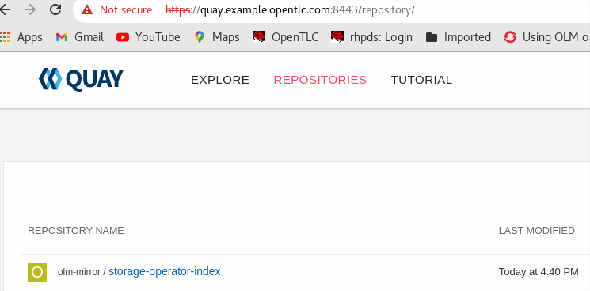

# disconnected-odf

**Git**

```
echo "# disconnected-odf" >> README.md
git init
git add README.md
git commit -m "first commit"
git branch -M main
git remote add origin https://github.com/alpha-wolf-jin/disconnected-odf.git
git config --global credential.helper 'cache --timeout 72000'
git push -u origin main

git add . ; git commit -a -m "update README" ; git push -u origin main

```

https://docs.openshift.com/container-platform/4.10/operators/admin/olm-restricted-networks.html

## Create quay mirror registry

https://github.com/alpha-wolf-jin/quay-mirrot-registry

## Mirror ODF Operator

```
# mkdir /opt/registry/mirror-operator

# cd /opt/registry/mirror-operator

# wget https://github.com/fullstorydev/grpcurl/releases/download/v1.8.6/grpcurl_1.8.6_linux_x86_64.tar.gz

# tar xvf grpcurl_1.8.6_linux_x86_64.tar.gz  -C /usr/local/sbin

# grpcurl --version
grpcurl v1.8.6

# wget https://mirror.openshift.com/pub/openshift-v4/x86_64/clients/ocp/latest-4.10/opm-linux.tar.gz

# tar xvf opm-linux.tar.gz -C /usr/local/sbin

# opm version
Version: version.Version{OpmVersion:"c10b001a3", GitCommit:"c10b001a30646331083c2e03f5790616f47a69a8", BuildDate:"2022-06-10T06:09:46Z", GoOs:"linux", GoArch:"amd64"}

# podman version
Client:       Podman Engine
Version:      4.0.2
API Version:  4.0.2
Go Version:   go1.17.7

Built:      Tue Apr 19 10:16:32 2022
OS/Arch:    linux/amd64

[root@localhost aro]# oc get clusterversion
NAME      VERSION   AVAILABLE   PROGRESSING   SINCE   STATUS
version   4.10.11   True        False         76m     Cluster version is 4.10.11

```

```
# podman login registry.redhat.io
Username: jinzha1@redhat.com


```

```
# podman run -p50051:50051 -it registry.redhat.io/redhat/certified-operator-index:v4.10
Trying to pull registry.redhat.io/redhat/certified-operator-index:v4.10...
Error: Source image rejected: Invalid GPG signature: gpgme.Signature{Summary:128, Fingerprint:"1AC4971355A34A82", Status:gpgme.Error{err:0x9}, Timestamp:time.Date(2022, time.July, 2, 11, 43, 10, 0, time.Local), ExpTimestamp:time.Date(1970, time.January, 1, 0, 0, 0, 0, time.Local), WrongKeyUsage:false, PKATrust:0x0, ChainModel:false, Validity:0, ValidityReason:error(nil), PubkeyAlgo:1, HashAlgo:8}
```

https://access.redhat.com/solutions/6542281

```
# curl -s -o /etc/pki/rpm-gpg/RPM-GPG-KEY-redhat-isv https://www.redhat.com/security/data/55A34A82.txt


```

Modify the file /etc/containers/policy.json to be as follow:

```

{
  "default": [
      {
          "type": "insecureAcceptAnything"
      }
  ],
  "transports":
    {
      "docker-daemon":
          {
              "": [{"type":"insecureAcceptAnything"}]
          },
      "docker":
        {
          "registry.redhat.io/redhat/certified-operator-index": [
            {
              "type": "signedBy",
              "keyType": "GPGKeys",
              "keyPath": "/etc/pki/rpm-gpg/RPM-GPG-KEY-redhat-isv"
            }
          ],
          "registry.redhat.io/redhat/community-operator-index": [
            {
              "type": "insecureAcceptAnything"
            }
          ],
          "registry.redhat.io/redhat/redhat-marketplace-index": [
            {
              "type": "signedBy",
              "keyType": "GPGKeys",
              "keyPath": "/etc/pki/rpm-gpg/RPM-GPG-KEY-redhat-isv"
            }
          ],
          "registry.redhat.io": [
            {
              "type": "signedBy",
              "keyType": "GPGKeys",
              "keyPath": "/etc/pki/rpm-gpg/RPM-GPG-KEY-redhat-release"
            }
          ]
        }
    }
}
```
Session A:
```
# podman run -p50051:50051 -it registry.redhat.io/redhat/redhat-operator-index:v4.10

```

Session B:
```
# grpcurl -plaintext localhost:50051 api.Registry/ListPackages > packages.out

# grep -1 local-storage-operator packages.out  >selected-operators.txt

# grep -1 mcg-operator packages.out >> selected-operators.txt 

# grep -1 odf-csi-addons-operator  packages.out >> selected-operators.txt 

# grep -1 odf-operator packages.out >> selected-operators.txt 

# cat selected-operators.txt 
{
  "name": "local-storage-operator"
}
{
  "name": "mcg-operator"
}
{
  "name": "ocs-operator"
}
{
  "name": "odf-csi-addons-operator"
}
{
  "name": "odf-operator"
}

##### below use the running index
# opm index prune -f registry.redhat.io/redhat/certified-operator-index:v4.10 -p mcg-operator,ocs-operator,odf-csi-addons-operator,odf-operator,local-storage-operator -t quay.example.opentlc.com:8443/olm-mirror/storage-operator-index:v4.10

# opm index prune -f registry.redhat.io/redhat/redhat-operator-index:v4.10 -p mcg-operator,ocs-operator,odf-csi-addons-operator,odf-operator,local-storage-operator -t quay.example.opentlc.com:8443/olm-mirror/storage-operator-index:v4.10

# podman login quay.example.opentlc.com:8443
Username: init
Password: 
Login Succeeded!

# podman push quay.example.opentlc.com:8443/olm-mirror/storage-operator-index:v4.10


```



**Verify the new index**


Session A:
```
# podman run -p50051:50051 -it quay.example.opentlc.com:8443/olm-mirror/storage-operator-index:v4.10

```

Session B:

New index has only the selected opertaors

```
# grpcurl -plaintext localhost:50051 api.Registry/ListPackages 
{
  "name": "local-storage-operator"
}
{
  "name": "mcg-operator"
}
{
  "name": "ocs-operator"
}
{
  "name": "odf-csi-addons-operator"
}
{
  "name": "odf-operator"
}

```

## Genate the CatalogSource & ImageContentSourcePolicy

**CatalogSource**

It needs a little modification, once we use namespace 'olm-mirror', like this 'quay.example.opentlc.com:8443/olm-mirror'.

```
# export REG_CREDS='/root/pull-secet.txt'

# oc adm catalog mirror quay.example.opentlc.com:8443/olm-mirror/storage-operator-index:v4.10 quay.example.opentlc.com:8443/olm-mirror -a ${REG_CREDS} --index-filter-by-os='linux/amd64' --manifests-only

!!!!!!!!!!!!!!!!!!!!!!!!!!!!!!!!!!!!!!!!!!!!!!!!!!!!!!!!!!!!!!!!!!!!!!!!!!!!!!!!
!! DEPRECATION NOTICE:
!!   Sqlite-based catalogs are deprecated. Support for them will be removed in a
!!   future release. Please migrate your catalog workflows to the new file-based
!!   catalog format.
!!!!!!!!!!!!!!!!!!!!!!!!!!!!!!!!!!!!!!!!!!!!!!!!!!!!!!!!!!!!!!!!!!!!!!!!!!!!!!!!

src image has index label for database path: /database/index.db
using index path mapping: /database/index.db:/tmp/1812195246
wrote database to /tmp/1812195246
using database at: /tmp/1812195246/index.db
no digest mapping available for quay.example.opentlc.com:8443/olm-mirror/storage-operator-index:v4.10, skip writing to ImageContentSourcePolicy
wrote mirroring manifests to manifests-storage-operator-index-1656838649
deleted dir /tmp/1812195246

# cat manifests-storage-operator-index-1656838649/catalogSource.yaml 
apiVersion: operators.coreos.com/v1alpha1
kind: CatalogSource
metadata:
  name: storage-operator-index
  namespace: openshift-marketplace
spec:
  image: quay.example.opentlc.com:8443/olm-mirror/olm-mirror-storage-operator-index:v4.10
  sourceType: grpc

# vim manifests-storage-operator-index-1656838649/catalogSource.yaml 

# cat manifests-storage-operator-index-1656838649/catalogSource.yaml 
apiVersion: operators.coreos.com/v1alpha1
kind: CatalogSource
metadata:
  name: storage-operator-index
  namespace: openshift-marketplace
spec:
  image: quay.example.opentlc.com:8443/olm-mirror/storage-operator-index:v4.10
  sourceType: grpc

```
**ImageContentSourcePolicy**

It looks ok, do not need modification, once we use namespace 'olm-mirror', like this 'quay.example.opentlc.com:8443/olm-mirror'.

```
[root@quay mirror-operator]# head -15 manifests-storage-operator-index-1656849584/imageContentSourcePolicy.yaml 
---
apiVersion: operator.openshift.io/v1alpha1
kind: ImageContentSourcePolicy
metadata:
  labels:
    operators.openshift.org/catalog: "true"
  name: storage-operator-index-0
spec:
  repositoryDigestMirrors:
  - mirrors:
    - quay.example.opentlc.com:8443/olm-mirror/odf4-mcg-rhel8-operator
    source: registry.redhat.io/odf4/mcg-rhel8-operator
  - mirrors:
    - quay.example.opentlc.com:8443/olm-mirror/openshift4-ose-csi-external-resizer
    source: registry.redhat.io/openshift4/ose-csi-external-resizer
...
```

## Dowload the operators' images to local disk

```
[root@quay mirror-operator]# pwd
/opt/registry/mirror-operator

[root@quay mirror-operator]# ll
total 8
drwxr-xr-x. 2 root root   88 Jul  3 11:59 manifests-storage-operator-index-1656849584
-rw-r--r--. 1 root root 3226 Jul  3 08:24 packages.out
-rw-r--r--. 1 root root  166 Jul  3 08:28 selected-operators.txt
[root@quay mirror-operator]# 

# oc adm catalog mirror quay.example.opentlc.com:8443/olm-mirror/storage-operator-index:v4.10 file:///local/index -a /root/pull-secet.txt --index-filter-by-os='linux/amd64'

[root@quay mirror-operator]# ll
total 8
drwxr-xr-x. 2 root root   88 Jul  3 11:59 manifests-storage-operator-index-1656849584
drwxr-xr-x. 2 root root   25 Jul  3 12:26 manifests-storage-operator-index-1656850468
-rw-r--r--. 1 root root 3226 Jul  3 08:24 packages.out
-rw-r--r--. 1 root root  166 Jul  3 08:28 selected-operators.txt
drwxr-xr-x. 3 root root   19 Jul  3 12:17 v2
[root@quay mirror-operator]# du -sk ./v2
54099840	./v2

```

## Upload the images to quay mirror registry from local disk

```
# ll -d v2/local/index/olm-mirror/storage-operator-index/
drwxr-xr-x. 8 root root 93 Jul  3 12:26 v2/local/index/olm-mirror/storage-operator-index/

# oc adm catalog mirror file://local/index/olm-mirror/storage-operator-index:v4.10 quay.example.opentlc.com:8443/olm-mirror -a /root/pull-secet.txt --index-filter-by-os='.*'

# df -Th /opt/registry/
Filesystem            Type  Size  Used Avail Use% Mounted on
/dev/mapper/quay-lv00 xfs   512G  112G  400G  22% /opt/registry

```

# Install Operator

## update pull secret and cert

**Update pull secret**

https://access.redhat.com/solutions/5789671

```
# scp jin@quay.example.opentlc.com:~/pull-secret.txt .

# oc get secret pull-secret -n openshift-config --template='{{index .data ".dockerconfigjson" | base64decode}}' >./current-pull-secret.json

# cat ./current-pull-secret.json | jq .
{
  "auths": {
    "cloud.openshift.com": {
      "auth": "b3BlbnNxxxxxxxSVYwSw==",
      "email": "jinzha@redhat.com"
    },
    "quay.io": {
      "auth": "b3BlbnNoaWZ0LXVYwSw==",
      "email": "jinzha@redhat.com"
    },
    "registry.connect.redhat.com": {
      "auth": "NTEzMTcNkpnaw==",
      "email": "jinzha@redhat.com"
    },
    "registry.redhat.io": {
      "auth": "NTEzMTcxNkpnaw==",
      "email": "jinzha@redhat.com"
    }
  }
}

# podman login --authfile=./auth.json quay.example.opentlc.com:8443 --tls-verify=false 

# cat auth.json 
{
	"auths": {
		"quay.example.opentlc.com:8443": {
			"auth": "aW5pdDozYXhlSjdrQTV5TDRWOTFaUDh0MjZqT28wVHBkYlFEQw=="
		}
	}
}

# jq -c --argjson var "$(jq .auths auth.json)" '.auths += $var' ./current-pull-secret.json > merged_pullsecret.json

# cat merged_pullsecret.json
{"auths":{"cloud.openshift.com":{"auth":"b3BlbnNoaWZ0LXOVTIwSVYwSw==","email":"jinzha@redhat.com"},"quay.io":{"auth":"bXE1dGkxZ3c6VEk1TkUyVVZTVFlNVVBPT....

# jq . merged_pullsecret.json 
{
  "auths": {
    "cloud.openshift.com": {
      "auth": "b3BlbnNxxxxxxxSVYwSw==",
      "email": "jinzha@redhat.com"
    },
    "quay.io": {
      "auth": "b3BlbnNoaWZ0LXVYwSw==",
      "email": "jinzha@redhat.com"
    },
    "registry.connect.redhat.com": {
      "auth": "NTEzMTcNkpnaw==",
      "email": "jinzha@redhat.com"
    },
    "registry.redhat.io": {
      "auth": "NTEzMTcxNkpnaw==",
      "email": "jinzha@redhat.com"
    },
    "quay.example.opentlc.com:8443": {
      "auth": "aW5pdDozYXhlSjdrQTV5TDRWOTFaUDh0MjZqT28wVHBkYlFEQw=="
    }
  }
}

# oc set data secret/pull-secret --from-file=.dockerconfigjson=/root/odf/merged_pullsecret.json -n openshift-config

```

**Add Quay Registry CA**


https://access.redhat.com/solutions/5662061

https://access.redhat.com/solutions/4654511

On Quay server:

```
[root@quay quay-rootCA]# pwd
/opt/registry/quay/quay-rootCA
[root@quay quay-rootCA]# ll
total 12
-rw-------. 1 root root 1679 Jul  3 06:48 rootCA.key
-rw-r--r--. 1 root root 1383 Jul  3 06:48 rootCA.pem
-rw-r--r--. 1 root root   41 Jul  3 06:48 rootCA.srl

# cp rootCA.pem /tmp/rootCA.pem

# chown jin /tmp/rootCA.pem

```

Copy the CA file to the local server

```
# pwd
/root/odf

# scp jin@quay.example.opentlc.com:/tmp/rootCA.pem .


oc create configmap registry-cas -n openshift-config \
--from-file=quay.example.opentlc.com..8443=/etc/docker/certs.d/quay.example.opentlc.com:8443/ca.crt \
--from-file=otherregistry.com=/etc/docker/certs.d/otherregistry.com/ca.crt

# oc create configmap registry-cas -n openshift-config --from-file=quay.example.opentlc.com..8443=/root/odf/rootCA.pem

# oc get configmap registry-cas -o yaml
apiVersion: v1
data:
  quay.example.opentlc.com..8443: |
    -----BEGIN CERTIFICATE-----
    MIIDzzCCAregAwIBAgIUYkCFPv4cKElb5MB4aGP9YRDzGfMwDQYJKoZIhvcNAQEL
    BQAwcjELMAkGA1UEBhMCVVMxCzAJBgNVBAgMAlZBMREwDwYDVQQHDAhOZXcgWW9y
    azENMAsGA1UECgwEUXVheTERMA8GA1UECwwIRGl2aXNpb24xITAfBgNVBAMMGHF1
    YXkuZXhhbXBsZS5vcGVudGxjLmNvbTAeFw0yMjA3MDMwNjQ4MjZaFw0yNTA0MjIw
    NjQ4MjZaMHIxCzAJBgNVBAYTAlVTMQswCQYDVQQIDAJWQTERMA8GA1UEBwwITmV3
    IFlvcmsxDTALBgNVBAoMBFF1YXkxETAPBgNVBAsMCERpdmlzaW9uMSEwHwYDVQQD
    DBhxdWF5LmV4YW1wbGUub3BlbnRsYy5jb20wggEiMA0GCSqGSIb3DQEBAQUAA4IB
    DwAwggEKAoIBAQC3IWAwTzQs+WDhcNgw3P0yL/c+weP793knu2dP1DsJDdoF3iuL
    6r4EQzbYm2DKW3zOvJO9+gq8LF9/odYNzKqMYy+7tQjdC+pLhIXxa9XZbAvQLuq0
    +evlHlwo+FQG5SSv1EkcViv24KiES6uRQqJlzQvnUaSZbHl681H4O66r2ED03mYg
    2evsP1HOQ2yFCN0L/ggalyJ7q/ENnnVvUTjCcEGzXxlCFIWmt/YyihjbPjQkJdTT
    LRhPunD9v3iCr3rv8/HoihlLlpmwfa2t5G5uY+UAnTeBYpzIHHuSTHonDftiYdSW
    xLMTrEBcXsjb+Qox2Faf46mwCmSiC/5MuZ07AgMBAAGjXTBbMAsGA1UdDwQEAwIC
    5DATBgNVHSUEDDAKBggrBgEFBQcDATAjBgNVHREEHDAaghhxdWF5LmV4YW1wbGUu
    b3BlbnRsYy5jb20wEgYDVR0TAQH/BAgwBgEB/wIBATANBgkqhkiG9w0BAQsFAAOC
    AQEAd2rqG4tfnzmQYP6WK/7qMzlOfmNu953YpEbtZBtf3zHhar4v0FwFlWhLx8t6
    ANpJ+3I/LCmbXFQbbWget0Vb1oCAqb4Ncj8yYSv0RB/DqIh05PIar5GZ1ePjRMqc
    tM3uMJTDyUguSJB0H6hfplhXodW2bcm/m56Q/PqNJ7G2qWPK2heHnTjMO8a/7gMj
    orCxNMajdyL/xz1QSq7UU6Klkxpj6vFNe/Pi1/ppgyYsSzFWFCXQ3lcdllOfLhxB
    rQ149b5DPnHwH97CrzgHuKwg7JFoInmIJ6ymM7MIM9Fo1l8W2dsyMHPq+8sPZtz5
    D8CvD0VgoDk3etadaI/pGbk9PA==
    -----END CERTIFICATE-----
kind: ConfigMap
metadata:
  creationTimestamp: "2022-07-04T02:01:23Z"
  name: registry-cas
  namespace: openshift-config
  resourceVersion: "442177"
  uid: c535cc8e-6f1b-4233-9e10-409a4cf0f599

# oc patch image.config.openshift.io/cluster --patch '{"spec":{"additionalTrustedCA":{"name":"registry-cas"}}}' --type=merge

# oc get image.config.openshift.io/cluster -o yaml
apiVersion: config.openshift.io/v1
kind: Image
metadata:
  annotations:
    include.release.openshift.io/ibm-cloud-managed: "true"
    include.release.openshift.io/self-managed-high-availability: "true"
    include.release.openshift.io/single-node-developer: "true"
    release.openshift.io/create-only: "true"
  creationTimestamp: "2022-07-03T06:18:17Z"
  generation: 2
  name: cluster
  ownerReferences:
  - apiVersion: config.openshift.io/v1
    kind: ClusterVersion
    name: version
    uid: 0bdd9809-23a1-4f17-9eca-5d7d9be331b2
  resourceVersion: "443047"
  uid: 4e3d2385-0933-4471-ab35-ef0be6071b8d
spec:
  additionalTrustedCA:
    name: registry-cas
status:
  internalRegistryHostname: image-registry.openshift-image-registry.svc:5000


# oc edit image.config.openshift.io/cluster 
...
spec:
  additionalTrustedCA:
    name: registry-cas
  registrySources:
    allowedRegistries:
    - quay.example.opentlc.com:8443
...

```

```
# hostname 
aro-68822-master-0

sh-4.4# cd /etc/docker/certs.d/

sh-4.4# ls
image-registry.openshift-image-registry.svc.cluster.local:5000  image-registry.openshift-image-registry.svc:5000  quay.example.opentlc.com:8443

sh-4.4# cd quay.example.opentlc.com\:8443/
sh-4.4# ls
ca.crt
sh-4.4# cat ca.crt 
-----BEGIN CERTIFICATE-----
MIIDzzCCAregAwIBAgIUYkCFPv4cKElb5MB4aGP9YRDzGfMwDQYJKoZIhvcNAQEL
BQAwcjELMAkGA1UEBhMCVVMxCzAJBgNVBAgMAlZBMREwDwYDVQQHDAhOZXcgWW9y
azENMAsGA1UECgwEUXVheTERMA8GA1UECwwIRGl2aXNpb24xITAfBgNVBAMMGHF1
YXkuZXhhbXBsZS5vcGVudGxjLmNvbTAeFw0yMjA3MDMwNjQ4MjZaFw0yNTA0MjIw
NjQ4MjZaMHIxCzAJBgNVBAYTAlVTMQswCQYDVQQIDAJWQTERMA8GA1UEBwwITmV3
IFlvcmsxDTALBgNVBAoMBFF1YXkxETAPBgNVBAsMCERpdmlzaW9uMSEwHwYDVQQD
DBhxdWF5LmV4YW1wbGUub3BlbnRsYy5jb20wggEiMA0GCSqGSIb3DQEBAQUAA4IB
DwAwggEKAoIBAQC3IWAwTzQs+WDhcNgw3P0yL/c+weP793knu2dP1DsJDdoF3iuL
6r4EQzbYm2DKW3zOvJO9+gq8LF9/odYNzKqMYy+7tQjdC+pLhIXxa9XZbAvQLuq0
+evlHlwo+FQG5SSv1EkcViv24KiES6uRQqJlzQvnUaSZbHl681H4O66r2ED03mYg
2evsP1HOQ2yFCN0L/ggalyJ7q/ENnnVvUTjCcEGzXxlCFIWmt/YyihjbPjQkJdTT
LRhPunD9v3iCr3rv8/HoihlLlpmwfa2t5G5uY+UAnTeBYpzIHHuSTHonDftiYdSW
xLMTrEBcXsjb+Qox2Faf46mwCmSiC/5MuZ07AgMBAAGjXTBbMAsGA1UdDwQEAwIC
5DATBgNVHSUEDDAKBggrBgEFBQcDATAjBgNVHREEHDAaghhxdWF5LmV4YW1wbGUu
b3BlbnRsYy5jb20wEgYDVR0TAQH/BAgwBgEB/wIBATANBgkqhkiG9w0BAQsFAAOC
AQEAd2rqG4tfnzmQYP6WK/7qMzlOfmNu953YpEbtZBtf3zHhar4v0FwFlWhLx8t6
ANpJ+3I/LCmbXFQbbWget0Vb1oCAqb4Ncj8yYSv0RB/DqIh05PIar5GZ1ePjRMqc
tM3uMJTDyUguSJB0H6hfplhXodW2bcm/m56Q/PqNJ7G2qWPK2heHnTjMO8a/7gMj
orCxNMajdyL/xz1QSq7UU6Klkxpj6vFNe/Pi1/ppgyYsSzFWFCXQ3lcdllOfLhxB
rQ149b5DPnHwH97CrzgHuKwg7JFoInmIJ6ymM7MIM9Fo1l8W2dsyMHPq+8sPZtz5
D8CvD0VgoDk3etadaI/pGbk9PA==
-----END CERTIFICATE-----
```
## disble

```
# oc patch OperatorHub cluster --type json \
      -p '[{"op": "add", "path": "/spec/disableAllDefaultSources", "value": true}]'

# cat catalogSource.yaml
apiVersion: operators.coreos.com/v1alpha1
kind: CatalogSource
metadata:
  name: storage-operator-index
  namespace: openshift-marketplace
spec:
  image: quay.example.opentlc.com:8443/olm-mirror/olm-mirror-storage-operator-index:v4.10
  sourceType: grpc

# oc project openshift-config

```
