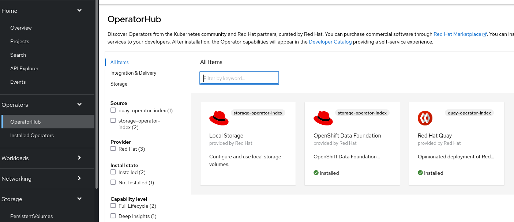
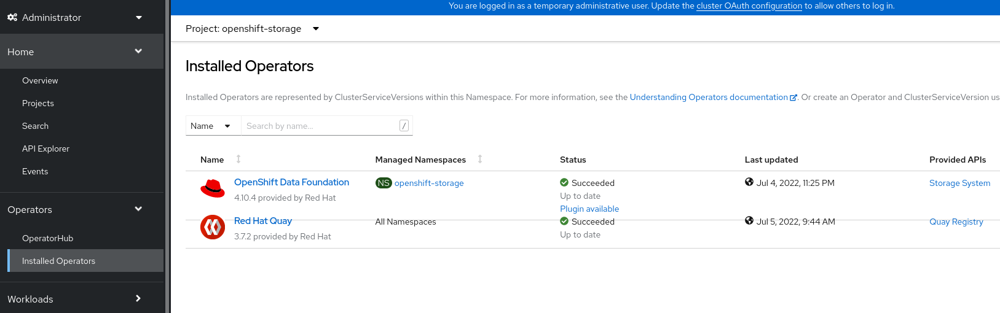
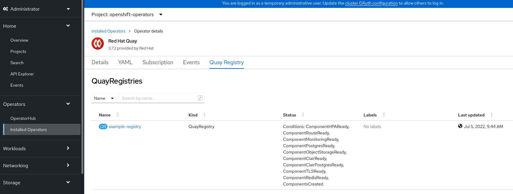

# disconnected-odf

**Git**

```
echo "# disconnected-odf" >> README.md
git init
git add README.md
git commit -m "first commit"
git branch -M main
git remote add origin https://github.com/alpha-wolf-jin/disconnected-odf.git
git config --global credential.helper 'cache --timeout 72000'
git push -u origin main

git add . ; git commit -a -m "update README" ; git push -u origin main

```

https://docs.openshift.com/container-platform/4.10/operators/admin/olm-restricted-networks.html

## Create quay mirror registry

https://github.com/alpha-wolf-jin/quay-mirrot-registry

## Mirror ODF Operator

```
# mkdir /opt/registry/mirror-operator

# cd /opt/registry/mirror-operator

# wget https://github.com/fullstorydev/grpcurl/releases/download/v1.8.6/grpcurl_1.8.6_linux_x86_64.tar.gz

# tar xvf grpcurl_1.8.6_linux_x86_64.tar.gz  -C /usr/local/sbin

# grpcurl --version
grpcurl v1.8.6

# wget https://mirror.openshift.com/pub/openshift-v4/x86_64/clients/ocp/latest-4.10/opm-linux.tar.gz

# tar xvf opm-linux.tar.gz -C /usr/local/sbin

# opm version
Version: version.Version{OpmVersion:"c10b001a3", GitCommit:"c10b001a30646331083c2e03f5790616f47a69a8", BuildDate:"2022-06-10T06:09:46Z", GoOs:"linux", GoArch:"amd64"}

# podman version
Client:       Podman Engine
Version:      4.0.2
API Version:  4.0.2
Go Version:   go1.17.7

Built:      Tue Apr 19 10:16:32 2022
OS/Arch:    linux/amd64

[root@localhost aro]# oc get clusterversion
NAME      VERSION   AVAILABLE   PROGRESSING   SINCE   STATUS
version   4.10.11   True        False         76m     Cluster version is 4.10.11

```

```
# podman login registry.redhat.io
Username: jinzha1@redhat.com


```

```
# podman run -p50051:50051 -it registry.redhat.io/redhat/certified-operator-index:v4.10
Trying to pull registry.redhat.io/redhat/certified-operator-index:v4.10...
Error: Source image rejected: Invalid GPG signature: gpgme.Signature{Summary:128, Fingerprint:"1AC4971355A34A82", Status:gpgme.Error{err:0x9}, Timestamp:time.Date(2022, time.July, 2, 11, 43, 10, 0, time.Local), ExpTimestamp:time.Date(1970, time.January, 1, 0, 0, 0, 0, time.Local), WrongKeyUsage:false, PKATrust:0x0, ChainModel:false, Validity:0, ValidityReason:error(nil), PubkeyAlgo:1, HashAlgo:8}
```

https://access.redhat.com/solutions/6542281

```
# curl -s -o /etc/pki/rpm-gpg/RPM-GPG-KEY-redhat-isv https://www.redhat.com/security/data/55A34A82.txt


```

Modify the file /etc/containers/policy.json to be as follow:

```

{
  "default": [
      {
          "type": "insecureAcceptAnything"
      }
  ],
  "transports":
    {
      "docker-daemon":
          {
              "": [{"type":"insecureAcceptAnything"}]
          },
      "docker":
        {
          "registry.redhat.io/redhat/certified-operator-index": [
            {
              "type": "signedBy",
              "keyType": "GPGKeys",
              "keyPath": "/etc/pki/rpm-gpg/RPM-GPG-KEY-redhat-isv"
            }
          ],
          "registry.redhat.io/redhat/community-operator-index": [
            {
              "type": "insecureAcceptAnything"
            }
          ],
          "registry.redhat.io/redhat/redhat-marketplace-index": [
            {
              "type": "signedBy",
              "keyType": "GPGKeys",
              "keyPath": "/etc/pki/rpm-gpg/RPM-GPG-KEY-redhat-isv"
            }
          ],
          "registry.redhat.io": [
            {
              "type": "signedBy",
              "keyType": "GPGKeys",
              "keyPath": "/etc/pki/rpm-gpg/RPM-GPG-KEY-redhat-release"
            }
          ]
        }
    }
}
```
Session A:
```
# podman run -p50051:50051 -it registry.redhat.io/redhat/redhat-operator-index:v4.10

```

Session B:
```
# grpcurl -plaintext localhost:50051 api.Registry/ListPackages > packages.out

# grep -1 local-storage-operator packages.out  >selected-operators.txt

# grep -1 mcg-operator packages.out >> selected-operators.txt 

# grep -1 odf-csi-addons-operator  packages.out >> selected-operators.txt 

# grep -1 odf-operator packages.out >> selected-operators.txt 

# cat selected-operators.txt 
{
  "name": "local-storage-operator"
}
{
  "name": "mcg-operator"
}
{
  "name": "ocs-operator"
}
{
  "name": "odf-csi-addons-operator"
}
{
  "name": "odf-operator"
}

##### below use the running index
# opm index prune -f registry.redhat.io/redhat/certified-operator-index:v4.10 -p mcg-operator,ocs-operator,odf-csi-addons-operator,odf-operator,local-storage-operator -t quay.example.opentlc.com:8443/olm-mirror/storage-operator-index:v4.10

# opm index prune -f registry.redhat.io/redhat/redhat-operator-index:v4.10 -p mcg-operator,ocs-operator,odf-csi-addons-operator,odf-operator,local-storage-operator -t quay.example.opentlc.com:8443/olm-mirror/storage-operator-index:v4.10

# podman login quay.example.opentlc.com:8443
Username: init
Password: 
Login Succeeded!

# podman push quay.example.opentlc.com:8443/olm-mirror/storage-operator-index:v4.10


```


**Verify the new index**


Session A:
```
# podman run -p50051:50051 -it quay.example.opentlc.com:8443/olm-mirror/storage-operator-index:v4.10

```

Session B:

New index has only the selected opertaors

```
# grpcurl -plaintext localhost:50051 api.Registry/ListPackages 
{
  "name": "local-storage-operator"
}
{
  "name": "mcg-operator"
}
{
  "name": "ocs-operator"
}
{
  "name": "odf-csi-addons-operator"
}
{
  "name": "odf-operator"
}

```

## Genate the CatalogSource & ImageContentSourcePolicy

**CatalogSource**

It needs a little modification, once we use namespace 'olm-mirror', like this 'quay.example.opentlc.com:8443/olm-mirror'.

```
# export REG_CREDS='/root/pull-secet.txt'

# oc adm catalog mirror quay.example.opentlc.com:8443/olm-mirror/storage-operator-index:v4.10 quay.example.opentlc.com:8443/olm-mirror -a ${REG_CREDS} --index-filter-by-os='linux/amd64' --manifests-only

!!!!!!!!!!!!!!!!!!!!!!!!!!!!!!!!!!!!!!!!!!!!!!!!!!!!!!!!!!!!!!!!!!!!!!!!!!!!!!!!
!! DEPRECATION NOTICE:
!!   Sqlite-based catalogs are deprecated. Support for them will be removed in a
!!   future release. Please migrate your catalog workflows to the new file-based
!!   catalog format.
!!!!!!!!!!!!!!!!!!!!!!!!!!!!!!!!!!!!!!!!!!!!!!!!!!!!!!!!!!!!!!!!!!!!!!!!!!!!!!!!

src image has index label for database path: /database/index.db
using index path mapping: /database/index.db:/tmp/1812195246
wrote database to /tmp/1812195246
using database at: /tmp/1812195246/index.db
no digest mapping available for quay.example.opentlc.com:8443/olm-mirror/storage-operator-index:v4.10, skip writing to ImageContentSourcePolicy
wrote mirroring manifests to manifests-storage-operator-index-1656838649
deleted dir /tmp/1812195246

# cat manifests-storage-operator-index-1656838649/catalogSource.yaml 
apiVersion: operators.coreos.com/v1alpha1
kind: CatalogSource
metadata:
  name: storage-operator-index
  namespace: openshift-marketplace
spec:
  image: quay.example.opentlc.com:8443/olm-mirror/olm-mirror-storage-operator-index:v4.10
  sourceType: grpc

# vim manifests-storage-operator-index-1656838649/catalogSource.yaml 

# cat manifests-storage-operator-index-1656838649/catalogSource.yaml 
apiVersion: operators.coreos.com/v1alpha1
kind: CatalogSource
metadata:
  name: storage-operator-index
  namespace: openshift-marketplace
spec:
  image: quay.example.opentlc.com:8443/olm-mirror/storage-operator-index:v4.10
  sourceType: grpc

```
**ImageContentSourcePolicy**

It looks ok, do not need modification, once we use namespace 'olm-mirror', like this 'quay.example.opentlc.com:8443/olm-mirror'.

```
[root@quay mirror-operator]# head -15 manifests-storage-operator-index-1656849584/imageContentSourcePolicy.yaml 
---
apiVersion: operator.openshift.io/v1alpha1
kind: ImageContentSourcePolicy
metadata:
  labels:
    operators.openshift.org/catalog: "true"
  name: storage-operator-index-0
spec:
  repositoryDigestMirrors:
  - mirrors:
    - quay.example.opentlc.com:8443/olm-mirror/odf4-mcg-rhel8-operator
    source: registry.redhat.io/odf4/mcg-rhel8-operator
  - mirrors:
    - quay.example.opentlc.com:8443/olm-mirror/openshift4-ose-csi-external-resizer
    source: registry.redhat.io/openshift4/ose-csi-external-resizer
...
```

## Dowload the operators' images to local disk

```
[root@quay mirror-operator]# pwd
/opt/registry/mirror-operator

[root@quay mirror-operator]# ll
total 8
drwxr-xr-x. 2 root root   88 Jul  3 11:59 manifests-storage-operator-index-1656849584
-rw-r--r--. 1 root root 3226 Jul  3 08:24 packages.out
-rw-r--r--. 1 root root  166 Jul  3 08:28 selected-operators.txt
[root@quay mirror-operator]# 

# oc adm catalog mirror quay.example.opentlc.com:8443/olm-mirror/storage-operator-index:v4.10 file:///local/index -a /root/pull-secet.txt --index-filter-by-os='linux/amd64'

[root@quay mirror-operator]# ll
total 8
drwxr-xr-x. 2 root root   88 Jul  3 11:59 manifests-storage-operator-index-1656849584
drwxr-xr-x. 2 root root   25 Jul  3 12:26 manifests-storage-operator-index-1656850468
-rw-r--r--. 1 root root 3226 Jul  3 08:24 packages.out
-rw-r--r--. 1 root root  166 Jul  3 08:28 selected-operators.txt
drwxr-xr-x. 3 root root   19 Jul  3 12:17 v2
[root@quay mirror-operator]# du -sk ./v2
54099840	./v2

```

## Upload the images to quay mirror registry from local disk

```
# ll -d v2/local/index/olm-mirror/storage-operator-index/
drwxr-xr-x. 8 root root 93 Jul  3 12:26 v2/local/index/olm-mirror/storage-operator-index/

# oc adm catalog mirror file://local/index/olm-mirror/storage-operator-index:v4.10 quay.example.opentlc.com:8443/olm-mirror -a /root/pull-secet.txt --index-filter-by-os='.*'

# df -Th /opt/registry/
Filesystem            Type  Size  Used Avail Use% Mounted on
/dev/mapper/quay-lv00 xfs   512G  112G  400G  22% /opt/registry

```

# Install Operator

## update pull secret and cert

**Update pull secret**

https://access.redhat.com/solutions/5789671

```
# scp jin@quay.example.opentlc.com:~/pull-secret.txt .

# oc get secret pull-secret -n openshift-config --template='{{index .data ".dockerconfigjson" | base64decode}}' >./current-pull-secret.json

# cat ./current-pull-secret.json | jq .
{
  "auths": {
    "cloud.openshift.com": {
      "auth": "b3BlbnNxxxxxxxSVYwSw==",
      "email": "jinzha@redhat.com"
    },
    "quay.io": {
      "auth": "b3BlbnNoaWZ0LXVYwSw==",
      "email": "jinzha@redhat.com"
    },
    "registry.connect.redhat.com": {
      "auth": "NTEzMTcNkpnaw==",
      "email": "jinzha@redhat.com"
    },
    "registry.redhat.io": {
      "auth": "NTEzMTcxNkpnaw==",
      "email": "jinzha@redhat.com"
    }
  }
}

# podman login --authfile=./auth.json quay.example.opentlc.com:8443 --tls-verify=false 

# cat auth.json 
{
	"auths": {
		"quay.example.opentlc.com:8443": {
			"auth": "aW5pdDozYXhlSjdrQTV5TDRWOTFaUDh0MjZqT28wVHBkYlFEQw=="
		}
	}
}

# jq -c --argjson var "$(jq .auths auth.json)" '.auths += $var' ./current-pull-secret.json > merged_pullsecret.json

# cat merged_pullsecret.json
{"auths":{"cloud.openshift.com":{"auth":"b3BlbnNoaWZ0LXOVTIwSVYwSw==","email":"jinzha@redhat.com"},"quay.io":{"auth":"bXE1dGkxZ3c6VEk1TkUyVVZTVFlNVVBPT....

# jq . merged_pullsecret.json 
{
  "auths": {
    "cloud.openshift.com": {
      "auth": "b3BlbnNxxxxxxxSVYwSw==",
      "email": "jinzha@redhat.com"
    },
    "quay.io": {
      "auth": "b3BlbnNoaWZ0LXVYwSw==",
      "email": "jinzha@redhat.com"
    },
    "registry.connect.redhat.com": {
      "auth": "NTEzMTcNkpnaw==",
      "email": "jinzha@redhat.com"
    },
    "registry.redhat.io": {
      "auth": "NTEzMTcxNkpnaw==",
      "email": "jinzha@redhat.com"
    },
    "quay.example.opentlc.com:8443": {
      "auth": "aW5pdDozYXhlSjdrQTV5TDRWOTFaUDh0MjZqT28wVHBkYlFEQw=="
    }
  }
}

# oc set data secret/pull-secret --from-file=.dockerconfigjson=/root/odf/merged_pullsecret.json -n openshift-config

```

**Add Quay Registry CA**


https://access.redhat.com/solutions/5662061

https://access.redhat.com/solutions/4654511

On Quay server:

```
[root@quay quay-rootCA]# pwd
/opt/registry/quay/quay-rootCA
[root@quay quay-rootCA]# ll
total 12
-rw-------. 1 root root 1679 Jul  3 06:48 rootCA.key
-rw-r--r--. 1 root root 1383 Jul  3 06:48 rootCA.pem
-rw-r--r--. 1 root root   41 Jul  3 06:48 rootCA.srl

# cp rootCA.pem /tmp/rootCA.pem

# chown jin /tmp/rootCA.pem

```

Copy the CA file to the local server

```
# pwd
/root/odf

# scp jin@quay.example.opentlc.com:/tmp/rootCA.pem .


oc create configmap registry-cas -n openshift-config \
--from-file=quay.example.opentlc.com..8443=/etc/docker/certs.d/quay.example.opentlc.com:8443/ca.crt \
--from-file=otherregistry.com=/etc/docker/certs.d/otherregistry.com/ca.crt

# oc create configmap registry-cas -n openshift-config --from-file=quay.example.opentlc.com..8443=/root/odf/rootCA.pem

# oc get configmap registry-cas -o yaml
apiVersion: v1
data:
  quay.example.opentlc.com..8443: |
    -----BEGIN CERTIFICATE-----
    MIIDzzCCAregAwIBAgIUYkCFPv4cKElb5MB4aGP9YRDzGfMwDQYJKoZIhvcNAQEL
    BQAwcjELMAkGA1UEBhMCVVMxCzAJBgNVBAgMAlZBMREwDwYDVQQHDAhOZXcgWW9y
    azENMAsGA1UECgwEUXVheTERMA8GA1UECwwIRGl2aXNpb24xITAfBgNVBAMMGHF1
    YXkuZXhhbXBsZS5vcGVudGxjLmNvbTAeFw0yMjA3MDMwNjQ4MjZaFw0yNTA0MjIw
    NjQ4MjZaMHIxCzAJBgNVBAYTAlVTMQswCQYDVQQIDAJWQTERMA8GA1UEBwwITmV3
    IFlvcmsxDTALBgNVBAoMBFF1YXkxETAPBgNVBAsMCERpdmlzaW9uMSEwHwYDVQQD
    DBhxdWF5LmV4YW1wbGUub3BlbnRsYy5jb20wggEiMA0GCSqGSIb3DQEBAQUAA4IB
    DwAwggEKAoIBAQC3IWAwTzQs+WDhcNgw3P0yL/c+weP793knu2dP1DsJDdoF3iuL
    6r4EQzbYm2DKW3zOvJO9+gq8LF9/odYNzKqMYy+7tQjdC+pLhIXxa9XZbAvQLuq0
    +evlHlwo+FQG5SSv1EkcViv24KiES6uRQqJlzQvnUaSZbHl681H4O66r2ED03mYg
    2evsP1HOQ2yFCN0L/ggalyJ7q/ENnnVvUTjCcEGzXxlCFIWmt/YyihjbPjQkJdTT
    LRhPunD9v3iCr3rv8/HoihlLlpmwfa2t5G5uY+UAnTeBYpzIHHuSTHonDftiYdSW
    xLMTrEBcXsjb+Qox2Faf46mwCmSiC/5MuZ07AgMBAAGjXTBbMAsGA1UdDwQEAwIC
    5DATBgNVHSUEDDAKBggrBgEFBQcDATAjBgNVHREEHDAaghhxdWF5LmV4YW1wbGUu
    b3BlbnRsYy5jb20wEgYDVR0TAQH/BAgwBgEB/wIBATANBgkqhkiG9w0BAQsFAAOC
    AQEAd2rqG4tfnzmQYP6WK/7qMzlOfmNu953YpEbtZBtf3zHhar4v0FwFlWhLx8t6
    ANpJ+3I/LCmbXFQbbWget0Vb1oCAqb4Ncj8yYSv0RB/DqIh05PIar5GZ1ePjRMqc
    tM3uMJTDyUguSJB0H6hfplhXodW2bcm/m56Q/PqNJ7G2qWPK2heHnTjMO8a/7gMj
    orCxNMajdyL/xz1QSq7UU6Klkxpj6vFNe/Pi1/ppgyYsSzFWFCXQ3lcdllOfLhxB
    rQ149b5DPnHwH97CrzgHuKwg7JFoInmIJ6ymM7MIM9Fo1l8W2dsyMHPq+8sPZtz5
    D8CvD0VgoDk3etadaI/pGbk9PA==
    -----END CERTIFICATE-----
kind: ConfigMap
metadata:
  creationTimestamp: "2022-07-04T02:01:23Z"
  name: registry-cas
  namespace: openshift-config
  resourceVersion: "442177"
  uid: c535cc8e-6f1b-4233-9e10-409a4cf0f599

# oc patch image.config.openshift.io/cluster --patch '{"spec":{"additionalTrustedCA":{"name":"registry-cas"}}}' --type=merge

# oc get image.config.openshift.io/cluster -o yaml
apiVersion: config.openshift.io/v1
kind: Image
metadata:
  annotations:
    include.release.openshift.io/ibm-cloud-managed: "true"
    include.release.openshift.io/self-managed-high-availability: "true"
    include.release.openshift.io/single-node-developer: "true"
    release.openshift.io/create-only: "true"
  creationTimestamp: "2022-07-03T06:18:17Z"
  generation: 2
  name: cluster
  ownerReferences:
  - apiVersion: config.openshift.io/v1
    kind: ClusterVersion
    name: version
    uid: 0bdd9809-23a1-4f17-9eca-5d7d9be331b2
  resourceVersion: "443047"
  uid: 4e3d2385-0933-4471-ab35-ef0be6071b8d
spec:
  additionalTrustedCA:
    name: registry-cas
status:
  internalRegistryHostname: image-registry.openshift-image-registry.svc:5000

```

**Verify the Cert on Master node**
```
# hostname 
aro-68822-master-0

sh-4.4# cd /etc/docker/certs.d/

sh-4.4# ls
image-registry.openshift-image-registry.svc.cluster.local:5000  image-registry.openshift-image-registry.svc:5000  quay.example.opentlc.com:8443

sh-4.4# cd quay.example.opentlc.com\:8443/
sh-4.4# ls
ca.crt
sh-4.4# cat ca.crt 
-----BEGIN CERTIFICATE-----
MIIDzzCCAregAwIBAgIUYkCFPv4cKElb5MB4aGP9YRDzGfMwDQYJKoZIhvcNAQEL
BQAwcjELMAkGA1UEBhMCVVMxCzAJBgNVBAgMAlZBMREwDwYDVQQHDAhOZXcgWW9y
azENMAsGA1UECgwEUXVheTERMA8GA1UECwwIRGl2aXNpb24xITAfBgNVBAMMGHF1
YXkuZXhhbXBsZS5vcGVudGxjLmNvbTAeFw0yMjA3MDMwNjQ4MjZaFw0yNTA0MjIw
NjQ4MjZaMHIxCzAJBgNVBAYTAlVTMQswCQYDVQQIDAJWQTERMA8GA1UEBwwITmV3
IFlvcmsxDTALBgNVBAoMBFF1YXkxETAPBgNVBAsMCERpdmlzaW9uMSEwHwYDVQQD
DBhxdWF5LmV4YW1wbGUub3BlbnRsYy5jb20wggEiMA0GCSqGSIb3DQEBAQUAA4IB
DwAwggEKAoIBAQC3IWAwTzQs+WDhcNgw3P0yL/c+weP793knu2dP1DsJDdoF3iuL
6r4EQzbYm2DKW3zOvJO9+gq8LF9/odYNzKqMYy+7tQjdC+pLhIXxa9XZbAvQLuq0
+evlHlwo+FQG5SSv1EkcViv24KiES6uRQqJlzQvnUaSZbHl681H4O66r2ED03mYg
2evsP1HOQ2yFCN0L/ggalyJ7q/ENnnVvUTjCcEGzXxlCFIWmt/YyihjbPjQkJdTT
LRhPunD9v3iCr3rv8/HoihlLlpmwfa2t5G5uY+UAnTeBYpzIHHuSTHonDftiYdSW
xLMTrEBcXsjb+Qox2Faf46mwCmSiC/5MuZ07AgMBAAGjXTBbMAsGA1UdDwQEAwIC
5DATBgNVHSUEDDAKBggrBgEFBQcDATAjBgNVHREEHDAaghhxdWF5LmV4YW1wbGUu
b3BlbnRsYy5jb20wEgYDVR0TAQH/BAgwBgEB/wIBATANBgkqhkiG9w0BAQsFAAOC
AQEAd2rqG4tfnzmQYP6WK/7qMzlOfmNu953YpEbtZBtf3zHhar4v0FwFlWhLx8t6
ANpJ+3I/LCmbXFQbbWget0Vb1oCAqb4Ncj8yYSv0RB/DqIh05PIar5GZ1ePjRMqc
tM3uMJTDyUguSJB0H6hfplhXodW2bcm/m56Q/PqNJ7G2qWPK2heHnTjMO8a/7gMj
orCxNMajdyL/xz1QSq7UU6Klkxpj6vFNe/Pi1/ppgyYsSzFWFCXQ3lcdllOfLhxB
rQ149b5DPnHwH97CrzgHuKwg7JFoInmIJ6ymM7MIM9Fo1l8W2dsyMHPq+8sPZtz5
D8CvD0VgoDk3etadaI/pGbk9PA==
-----END CERTIFICATE-----
```
## disble

```
# oc patch OperatorHub cluster --type json \
      -p '[{"op": "add", "path": "/spec/disableAllDefaultSources", "value": true}]'

# cat catalogSource.yaml
apiVersion: operators.coreos.com/v1alpha1
kind: CatalogSource
metadata:
  name: storage-operator-index
  namespace: openshift-marketplace
spec:
  image: quay.example.opentlc.com:8443/olm-mirror/storage-operator-index:v4.10
  sourceType: grpc

# oc project openshift-config

# oc apply -f catalogSource.yaml 

# oc get event -n openshift-marketplace
LAST SEEN   TYPE      REASON                         OBJECT                             MESSAGE
2m47s       Normal    Scheduled                      pod/storage-operator-index-7f2mg   Successfully assigned openshift-marketplace/storage-operator-index-7f2mg to aro-68822-worker-eastus-3
2m45s       Normal    AddedInterface                 pod/storage-operator-index-7f2mg   Add eth0 [10.129.2.12/23] from openshift-sdn
69s         Normal    Pulling                        pod/storage-operator-index-7f2mg   Pulling image "quay.example.opentlc.com:8443/olm-mirror/storage-operator-index:v4.10"
68s         Warning   Failed                         pod/storage-operator-index-7f2mg   Failed to pull image "quay.example.opentlc.com:8443/olm-mirror/storage-operator-index:v4.10": rpc error: code = Unknown desc = pinging container registry quay.example.opentlc.com:8443: Get "https://quay.example.opentlc.com:8443/v2/": dial tcp: lookup quay.example.opentlc.com on 168.63.129.16:53: no such host
68s         Warning   Failed                         pod/storage-operator-index-7f2mg   Error: ErrImagePull
40s         Normal    BackOff                        pod/storage-operator-index-7f2mg   Back-off pulling image "quay.example.opentlc.com:8443/olm-mirror/storage-operator-index:v4.10"
53s         Warning   Failed                         pod/storage-operator-index-7f2mg   Error: ImagePullBackOff
2m47s       Normal    Scheduled                      pod/storage-operator-index-hljwh   Successfully assigned openshift-marketplace/storage-operator-index-hljwh to aro-68822-worker-eastus-3
2m46s       Normal    AddedInterface                 pod/storage-operator-index-hljwh   Add eth0 [10.129.2.11/23] from openshift-sdn
2m46s       Normal    Pulling                        pod/storage-operator-index-hljwh   Pulling image "quay.example.opentlc.com:8443/olm-mirror/storage-operator-index:v4.10"
2m40s       Warning   Failed                         pod/storage-operator-index-hljwh   Failed to pull image "quay.example.opentlc.com:8443/olm-mirror/storage-operator-index:v4.10": rpc error: code = Unknown desc = pinging container registry quay.example.opentlc.com:8443: Get "https://quay.example.opentlc.com:8443/v2/": dial tcp: lookup quay.example.opentlc.com on 168.63.129.16:53: no such host
2m40s       Warning   Failed                         pod/storage-operator-index-hljwh   Error: ErrImagePull
2m47s       Warning   FailedToUpdateEndpointSlices   service/storage-operator-index     Error updating Endpoint Slices for Service openshift-marketplace/storage-operator-index: failed to delete storage-operator-index-smcd2 EndpointSlice for Service openshift-marketplace/storage-operator-index: endpointslices.discovery.k8s.io "storage-operator-index-smcd2" not found

```

**Check Master node name server**

https://access.redhat.com/solutions/4518671

https://access.redhat.com/solutions/5494101

```
sh-4.4# chroot /host
sh-4.4# ls /etc/resolv.conf 
/etc/resolv.conf
sh-4.4# cat /etc/resolv.conf    
# Generated by NetworkManager
search ghnjycmoauyejdox12jxyglfia.bx.internal.cloudapp.net
nameserver 168.63.129.16
```

```
# cat << EOF | base64
search ghnjycmoauyejdox12jxyglfia.bx.internal.cloudapp.net example.opentlc.com
nameserver 168.63.129.16
nameserver 40.90.4.2
EOF
c2VhcmNoIGdobmp5Y21vYXV5ZWpkb3gxMmp4eWdsZmlhLmJ4LmludGVybmFsLmNsb3VkYXBwLm5l
dCBleGFtcGxlLm9wZW50bGMuY29tCm5hbWVzZXJ2ZXIgMTY4LjYzLjEyOS4xNgpuYW1lc2VydmVy
IDQwLjkwLjQuMgo=

# echo c2VhcmNoIGdobmp5Y21vYXV5ZWpkb3gxMmp4eWdsZmlhLmJ4LmludGVybmFsLmNsb3VkYXBwLm5ldCBleGFtcGxlLm9wZW50bGMuY29tCm5hbWVzZXJ2ZXIgMTY4LjYzLjEyOS4xNgpuYW1lc2VydmVyIDQwLjkwLjQuMgo= | base64 -d
search ghnjycmoauyejdox12jxyglfia.bx.internal.cloudapp.net example.opentlc.com
nameserver 168.63.129.16
nameserver 40.90.4.2

# oc get mcp
NAME     CONFIG                                             UPDATED   UPDATING   DEGRADED   MACHINECOUNT   READYMACHINECOUNT   UPDATEDMACHINECOUNT   DEGRADEDMACHINECOUNT   AGE
master   rendered-master-4122f3c621fcf0f8d292d82442756448   True      False      False      3              3                   3                     0                      20h
worker   rendered-worker-ba5e2cbac805c5136e7c26a4f56cbfd4   True      False      False      3              3                   3                     0                      20h


# oc get mcp worker -o yaml
...
  machineConfigSelector:
    matchLabels:
      machineconfiguration.openshift.io/role: worker
  nodeSelector:
    matchLabels:
      node-role.kubernetes.io/worker: ""
...

# vim work-dns.yaml
apiVersion: machineconfiguration.openshift.io/v1
kind: MachineConfig
metadata:
  labels:
    machineconfiguration.openshift.io/role: worker
  name: 99-worker-nameserver
spec:
  config:
    ignition:
      version: 2.2.0
    storage:
      files:
      - contents:
          source: data:text/plain;charset=utf-8;base64,c2VhcmNoIGdobmp5Y21vYXV5ZWpkb3gxMmp4eWdsZmlhLmJ4LmludGVybmFsLmNsb3VkYXBwLm5ldCBleGFtcGxlLm9wZW50bGMuY29tCm5hbWVzZXJ2ZXIgMTY4LjYzLjEyOS4xNgpuYW1lc2VydmVyIDQwLjkwLjQuMgo=
        filesystem: root
        mode: 0644
        path: /etc/resolv.conf

# oc apply -f work-dns.yaml 

# oc get mc | grep nameserver
99-worker-nameserver                                                                          2.2.0             27s

# oc get mcp
NAME     CONFIG                                             UPDATED   UPDATING   DEGRADED   MACHINECOUNT   READYMACHINECOUNT   UPDATEDMACHINECOUNT   DEGRADEDMACHINECOUNT   AGE
master   rendered-master-4122f3c621fcf0f8d292d82442756448   True      False      False      3              3                   3                     0                      20h
worker   rendered-worker-ba5e2cbac805c5136e7c26a4f56cbfd4   False     True       False      3              0                   0                     0                      20h

# oc get mcp master -o yaml
...
  machineConfigSelector:
    matchLabels:
      machineconfiguration.openshift.io/role: master
  nodeSelector:
    matchLabels:
      node-role.kubernetes.io/master: ""
...

# cat master-dns.yaml 
apiVersion: machineconfiguration.openshift.io/v1
kind: MachineConfig
metadata:
  labels:
    machineconfiguration.openshift.io/role: master
  name: 99-master-nameserver
spec:
  config:
    ignition:
      version: 2.2.0
    storage:
      files:
      - contents:
          source: data:text/plain;charset=utf-8;base64,c2VhcmNoIGdobmp5Y21vYXV5ZWpkb3gxMmp4eWdsZmlhLmJ4LmludGVybmFsLmNsb3VkYXBwLm5ldCBleGFtcGxlLm9wZW50bGMuY29tCm5hbWVzZXJ2ZXIgMTY4LjYzLjEyOS4xNgpuYW1lc2VydmVyIDQwLjkwLjQuMgo=
        filesystem: root
        mode: 0644
        path: /etc/resolv.conf

# oc apply -f master-dns.yaml

# oc get mc | grep nameserver
99-master-nameserver                                                                          2.2.0             19s
99-worker-nameserver                                                                          2.2.0             17m

### Until...
# oc get mcp
NAME     CONFIG                                             UPDATED   UPDATING   DEGRADED   MACHINECOUNT   READYMACHINECOUNT   UPDATEDMACHINECOUNT   DEGRADEDMACHINECOUNT   AGE
master   rendered-master-d6ae21c89b91075cc2e823699862d534   True      False      False      3              3                   3                     0                      21h
worker   rendered-worker-3fd309422aa36e7633c7d6acd382427e   True      False      False      3              3                   3                     0                      21h
```

> Note: I change the /etc/hosts file to include `20.55.58.122  quay.example.opentlc.com` due to firewall

Add the 512 GB HHD to each worker nodes

Install local storage operator

`Operators` => `Installed Operators` => Click `LocalStorage` 

=> Click `Local Volume Discovery` => Click `Create Local Volume Discovery` button

=> Check `Disks on selected nodes` => Check worker nodes => Click `Create` button

Install `OpenShift Data Foundation`

=> Click `Create StorageSystem` button

=> Select `Create a new StorageClass using local storage devices` => Click `Next` Button

=>
 fill `LocalVolumeSet name`  with "odflocalvolum01"
 Select `Disks on selected nodes`
 Click `Next` Button

=>
 Select `Taint node`
 `The selected nodes do not match OpenShift Data Foundation's StorageCluster requirement of an aggregated 30 CPUs and 72 GiB of RAM. If the selection cannot be modified a minimal cluster will be deployed.`
 
 Click `Next` Button

=>
 Select `Enable data encryption for block and file storage`
 Select `Cluster-wide encryption`
 Click `Next` Button

=> Click `Create StorageSystem` button

> Note: It shows error page `404: Page Not Found`

Warning alert:Web console update is available
There has been an update to the web console. Ensure any changes have been saved and refresh your browser to access the latest version.

```
# oc project openshift-storage


# oc get event --sort-by='{.lastTimestamp}' | grep -v " Normal "
LAST SEEN   TYPE      REASON                         OBJECT                                                                     MESSAGE
11m         Warning   FailedScheduling               pod/noobaa-db-pg-0                                                         0/6 nodes are available: 6 pod has unbound immediate PersistentVolumeClaims.
14m         Warning   FailedScheduling               pod/rook-ceph-mon-a-78598ccdc4-pm9z6                                       0/6 nodes are available: 1 node(s) didn't match pod anti-affinity rules, 2 node(s) didn't match Pod's node affinity/selector, 3 node(s) had taint {node-role.kubernetes.io/master: }, that the pod didn't tolerate.
23m         Warning   FailedMount                    pod/odf-console-65685ddfd5-h8rhq                                           MountVolume.SetUp failed for volume "odf-console-serving-cert" : secret "odf-console-serving-cert" not found
14m         Warning   ReconcileFailed                storagesystem/ocs-storagecluster-storagesystem                             StorageCluster.ocs.openshift.io "ocs-storagecluster" not found
14m         Warning   ReconcileFailed                storagesystem/ocs-storagecluster-storagesystem                             Operation cannot be fulfilled on storageclusters.ocs.openshift.io "ocs-storagecluster": the object has been modified; please apply your changes to the latest version and try again
14m         Warning   FailedToUpdateEndpoint         endpoints/csi-rbdplugin-metrics                                            Failed to update endpoint openshift-storage/csi-rbdplugin-metrics: Operation cannot be fulfilled on endpoints "csi-rbdplugin-metrics": the object has been modified; please apply your changes to the latest version and try again
10m         Warning   Unhealthy                      pod/noobaa-endpoint-d8f58d469-w8wzq                                        Readiness probe failed: dial tcp 10.129.2.30:6001: connect: connection refused
9m14s       Warning   FailedGetResourceMetric        horizontalpodautoscaler/noobaa-endpoint                                    failed to get cpu utilization: unable to get metrics for resource cpu: no metrics returned from resource metrics API
9m14s       Warning   FailedComputeMetricsReplicas   horizontalpodautoscaler/noobaa-endpoint                                    invalid metrics (1 invalid out of 1), first error is: failed to get cpu utilization: unable to get metrics for resource cpu: no metrics returned from resource metrics API
6m58s       Warning   FailedComputeMetricsReplicas   horizontalpodautoscaler/noobaa-endpoint                                    invalid metrics (1 invalid out of 1), first error is: failed to get cpu utilization: did not receive metrics for any ready pods
6m43s       Warning   FailedGetResourceMetric        horizontalpodautoscaler/noobaa-endpoint                                    failed to get cpu utilization: did not receive metrics for any ready pods

# oc get pod noobaa-db-pg-0
NAME             READY   STATUS    RESTARTS   AGE
noobaa-db-pg-0   1/1     Running   0          14m

# oc get pod | grep rook-ceph-mon
rook-ceph-mon-a-78598ccdc4-pm9z6                                  2/2     Running     0          17m
rook-ceph-mon-b-55878dfdd8-jfmxq                                  2/2     Running     0          17m
rook-ceph-mon-c-67fb7448f5-wdsb6                                  2/2     Running     0          17m

# oc get secret | grep odf-console-serving-cert
odf-console-serving-cert                                                    kubernetes.io/tls                     2      28m

# oc get storagesystem/ocs-storagecluster-storagesystem
NAME                               STORAGE-SYSTEM-KIND                  STORAGE-SYSTEM-NAME
ocs-storagecluster-storagesystem   storagecluster.ocs.openshift.io/v1   ocs-storagecluster

# oc describe storagesystem/ocs-storagecluster-storagesystem
...
Events:
  Type     Reason           Age   From                      Message
  ----     ------           ----  ----                      -------
  Warning  ReconcileFailed  20m   StorageSystem controller  StorageCluster.ocs.openshift.io "ocs-storagecluster" not found
  Warning  ReconcileFailed  20m   StorageSystem controller  Operation cannot be fulfilled on storageclusters.ocs.openshift.io "ocs-storagecluster": the object has been modified; please apply your changes to the latest version and try again

# oc get  StorageCluster.ocs.openshift.io
NAME                 AGE   PHASE         EXTERNAL   CREATED AT             VERSION
ocs-storagecluster   23m   Progressing              2022-07-04T07:11:30Z   4.10.0

# oc describe StorageCluster.ocs.openshift.io ocs-storagecluster

    Message:               Waiting on Nooba instance to finish initialization
    Reason:                NoobaaInitializing
    Status:                True
    Type:                  Progressing
    Last Heartbeat Time:   2022-07-04T07:11:30Z
    Last Transition Time:  2022-07-04T07:11:30Z
    Message:               Initializing StorageCluster
    Reason:                Init
    Status:                False
    Type:                  Degraded
    Last Heartbeat Time:   2022-07-04T07:11:30Z
    Last Transition Time:  2022-07-04T07:11:30Z
    Message:               Initializing StorageCluster
    Reason:                Init
    Status:                Unknown
    Type:                  Upgradeable

# oc get pod | grep -i Nooba
noobaa-core-0                                                     1/1     Running     0          25m
noobaa-db-pg-0                                                    1/1     Running     0          25m
noobaa-endpoint-d8f58d469-w8wzq                                   1/1     Running     0          23m
noobaa-operator-568f79d7f-l58c7                                   1/1     Running     0          37m

# oc logs  noobaa-operator-568f79d7f-l58c7
...
time="2022-07-04T07:49:32Z" level=warning msg="⏳ Temporary Error: failed to start creating storage account: storage.AccountsClient#Create: Failure sending request: StatusCode=403 -- Original Error: Code=\"AuthorizationFailed\" Message=\"The client '055fd1df-fd96-4135-9911-8256047168c8' with object id '055fd1df-fd96-4135-9911-8256047168c8' does not have authorization to perform action 'Microsoft.Storage/storageAccounts/write' over scope '/subscriptions/ede7f891-835c-4128-af5b-0e53848e54e7/resourceGroups/aro-xxrms-rg/providers/Microsoft.Storage/storageAccounts/noobaaaccountb1cfw' or the scope is invalid. If access was recently granted, please refresh your credentials.\"" sys=openshift-storage/noobaa


```
> Note: aro-xxrms-rg is not used, auto generated by cluster. Current is openenv-5xkm2  resource group


```
# oc get secret noobaa-azure-cloud-creds-secret -o yaml
apiVersion: v1
data:
  azure_client_id: MmE5M2UzYjYtOTE4Yy00OWMwLTg4YjQtMjhjZWM4ZDFjNDRh
  azure_client_secret: dG50VE9yMU1tVENiUUt5LlRUMlM3b2YwWH5+dTUybWttUQ==
  azure_region: ZWFzdHVz
  azure_resource_prefix: YXJvLXh4cm1z
  azure_resourcegroup: YXJvLXh4cm1zLXJn
  azure_subscription_id: ZWRlN2Y4OTEtODM1Yy00MTI4LWFmNWItMGU1Mzg0OGU1NGU3
  azure_tenant_id: MWNlNzg1MmYtZGNmMy00MmJjLWFmZTYtM2JmODFhYjk4NGZi
kind: Secret
metadata:
  annotations:
    cloudcredential.openshift.io/credentials-request: openshift-storage/noobaa-azure-cloud-creds
  creationTimestamp: "2022-07-04T07:14:27Z"
  name: noobaa-azure-cloud-creds-secret
  namespace: openshift-storage
  resourceVersion: "84345"
  uid: ab863f95-167b-4911-ba6b-9f4d6a472ee1
type: Opaque
[root@localhost odf]# echo YXJvLXh4cm1zLXJn | base64 -d
aro-xxrms-rg

# oc set data secret/noobaa-azure-cloud-creds-secret azure_resourcegroup=openenv-5xkm2

# oc set data secret/noobaa-azure-container-creds azure_resourcegroup=openenv-5xkm2

# oc delete pod  noobaa-operator-568f79d7f-l58c7


```
# Verify ODF

Below result is the same as the succesful ODF instaslling in connectione environement.

But in disconnected environment, the 'Data Foumdation' under `Storage` is not there.

```
# oc get StorageSystem ocs-storagecluster-storagesystem -o yaml -n openshift-storage

apiVersion: odf.openshift.io/v1alpha1
kind: StorageSystem
metadata:
  creationTimestamp: "2022-07-04T07:11:30Z"
  finalizers:
  - storagesystem.odf.openshift.io
  generation: 1
  name: ocs-storagecluster-storagesystem
  namespace: openshift-storage
  resourceVersion: "80985"
  uid: 1dd5ab62-e458-4cde-aa43-e439f3421a3e
spec:
  kind: storagecluster.ocs.openshift.io/v1
  name: ocs-storagecluster
  namespace: openshift-storage
status:
  conditions:
  - lastHeartbeatTime: "2022-07-04T07:11:30Z"
    lastTransitionTime: "2022-07-04T07:11:30Z"
    message: Reconcile is completed successfully
    reason: ReconcileCompleted
    status: "True"
    type: Available
  - lastHeartbeatTime: "2022-07-04T07:11:30Z"
    lastTransitionTime: "2022-07-04T07:11:30Z"
    message: Reconcile is completed successfully
    reason: ReconcileCompleted
    status: "False"
    type: Progressing
  - lastHeartbeatTime: "2022-07-04T07:11:30Z"
    lastTransitionTime: "2022-07-04T07:11:30Z"
    message: StorageSystem CR is valid
    reason: Valid
    status: "False"
    type: StorageSystemInvalid
  - lastHeartbeatTime: "2022-07-04T07:11:30Z"
    lastTransitionTime: "2022-07-04T07:11:30Z"
    reason: Ready
    status: "True"
    type: VendorCsvReady
  - lastHeartbeatTime: "2022-07-04T07:11:30Z"
    lastTransitionTime: "2022-07-04T07:11:30Z"
    reason: Found
    status: "True"
    type: VendorSystemPresent

# oc describe StorageSystem ocs-storagecluster-storagesystem
...
Events:                    <none>

# oc get pod | grep operator
noobaa-operator-568f79d7f-26lwb                                   1/1     Running     0          4h4m
ocs-operator-94985c79c-d4dl5                                      1/1     Running     0          5h31m
odf-operator-controller-manager-57977dfd-qwwnh                    2/2     Running     0          5h31m
rook-ceph-operator-578f567c57-dvdjl                               1/1     Running     0          5h31m

# oc logs -f noobaa-operator-568f79d7f-26lwb
no error

# oc logs -f rook-ceph-operator-578f567c57-dvdjl

oc logs -f ocs-operator-94985c79c-d4dl5

oc logs -f odf-operator-controller-manager-57977dfd-qwwnh -c manager

oc logs -f odf-operator-controller-manager-57977dfd-qwwnh -c kube-rbac-proxy

```

# Download and Upload quay operator on quay registry server

```
# mkdir quay

# cd quay

# opm index prune -f registry.redhat.io/redhat/redhat-operator-index:v4.10 -p quay-operator -t quay.example.opentlc.com:8443/olm-mirror/quay-operator-index:v4.10

# podman push quay.example.opentlc.com:8443/olm-mirror/quay-operator-index:v4.10

# oc adm catalog mirror quay.example.opentlc.com:8443/olm-mirror/quay-operator-index:v4.10 quay.example.opentlc.com:8443/olm-mirror -a ${REG_CREDS} --index-filter-by-os='linux/amd64' --manifests-only

# ll manifests-quay-operator-index-1656938547
total 28
-rwxr-xr-x. 1 root root   247 Jul  4 12:42 catalogSource.yaml
-rwxr-xr-x. 1 root root  1547 Jul  4 12:42 imageContentSourcePolicy.yaml
-rw-r--r--. 1 root root 19865 Jul  4 12:42 mapping.txt

# vim manifests-quay-operator-index-1656938547/catalogSource.yaml
apiVersion: operators.coreos.com/v1alpha1
kind: CatalogSource
metadata:
  name: quay-operator-index
  namespace: openshift-marketplace
spec:
  image: quay.example.opentlc.com:8443/olm-mirror/quay-operator-index:v4.10
  sourceType: grpc

# oc adm catalog mirror quay.example.opentlc.com:8443/olm-mirror/quay-operator-index:v4.10 file:///local/index -a /root/pull-secet.txt --index-filter-by-os='linux/amd64'

# ll
total 0
drwxr-xr-x. 2 root root 88 Jul  4 12:43 manifests-quay-operator-index-1656938547
drwxr-xr-x. 2 root root 25 Jul  4 12:51 manifests-quay-operator-index-1656938710
drwxr-xr-x. 3 root root 19 Jul  4 12:45 v2

# ll  v2/local/index/olm-mirror/quay-operator-index/
total 4
drwxr-xr-x. 2 root root 4096 Jul  4 12:46 blobs
drwxr-xr-x. 2 root root   98 Jul  4 12:46 manifests
drwxr-xr-x. 9 root root  188 Jul  4 12:51 quay
drwxr-xr-x. 5 root root   57 Jul  4 12:46 rhel8

# oc adm catalog mirror file://local/index/olm-mirror/quay-operator-index:v4.10 quay.example.opentlc.com:8443/olm-mirror -a /root/pull-secet.txt --index-filter-by-os='.*'


```

# Install Qauy on OC client server

```
# mkdir quay

# cd quay

# vim catalogSource.yaml
apiVersion: operators.coreos.com/v1alpha1
kind: CatalogSource
metadata:
  name: quay-operator-index
  namespace: openshift-marketplace
spec:
  image: quay.example.opentlc.com:8443/olm-mirror/quay-operator-index:v4.10
  sourceType: grpc

# oc apply -f catalogSource.yaml

# vim imageContentSourcePolicy.yaml
---
apiVersion: operator.openshift.io/v1alpha1
kind: ImageContentSourcePolicy
metadata:
  labels:
    operators.openshift.org/catalog: "true"
  name: quay-operator-index-0
spec:
  repositoryDigestMirrors:
  - mirrors:
    - quay.example.opentlc.com:8443/olm-mirror/quay-clair-rhel8
    source: registry.redhat.io/quay/clair-rhel8
  - mirrors:
    - quay.example.opentlc.com:8443/olm-mirror/quay-quay-builder-rhel8
    source: registry.redhat.io/quay/quay-builder-rhel8
  - mirrors:
    - quay.example.opentlc.com:8443/olm-mirror/quay-quay-builder-qemu-rhcos-rhel8
    source: registry.redhat.io/quay/quay-builder-qemu-rhcos-rhel8
  - mirrors:
    - quay.example.opentlc.com:8443/olm-mirror/quay-quay-operator-bundle
    source: registry.redhat.io/quay/quay-operator-bundle
  - mirrors:
    - quay.example.opentlc.com:8443/olm-mirror/quay-quay-rhel8
    source: registry.redhat.io/quay/quay-rhel8
  - mirrors:
    - quay.example.opentlc.com:8443/olm-mirror/rhel8-redis-6
    source: registry.redhat.io/rhel8/redis-6
  - mirrors:
    - quay.example.opentlc.com:8443/olm-mirror/quay-quay-rhel8-operator
    source: registry.redhat.io/quay/quay-rhel8-operator
  - mirrors:
    - quay.example.opentlc.com:8443/olm-mirror/rhel8-postgresql-10
    source: registry.redhat.io/rhel8/postgresql-10
  - mirrors:
    - quay.example.opentlc.com:8443/olm-mirror/quay-quay-operator-rhel8
    source: registry.redhat.io/quay/quay-operator-rhel8
  - mirrors:
    - quay.example.opentlc.com:8443/olm-mirror/rhel8-redis-5
    source: registry.redhat.io/rhel8/redis-5


# oc apply -f imageContentSourcePolicy.yaml 

# oc project openshift-marketplace

# oc describe pod quay-operator-index-wpr75
...
Events:
  Type     Reason            Age                  From               Message
  ----     ------            ----                 ----               -------
  Warning  FailedScheduling  4m29s                default-scheduler  0/6 nodes are available: 3 node(s) had taint {node-role.kubernetes.io/master: }, that the pod didn't tolerate, 3 node(s) had taint {node.ocs.openshift.io/storage: true}, that the pod didn't tolerate.
  Warning  FailedScheduling  2m5s (x1 over 3m5s)  default-scheduler  0/6 nodes are available: 3 node(s) had taint {node-role.kubernetes.io/master: }, that the pod didn't tolerate, 3 node(s) had taint {node.ocs.openshift.io/storage: true}, that the pod didn't tolerate.

# oc explain CatalogSource.spec.grpcPodConfig
KIND:     CatalogSource
VERSION:  operators.coreos.com/v1alpha1

RESOURCE: grpcPodConfig <Object>

DESCRIPTION:
     GrpcPodConfig exposes different overrides for the pod spec of the
     CatalogSource Pod. Only used when SourceType = SourceTypeGrpc and Image is
     set.

FIELDS:
   nodeSelector	<map[string]string>
     NodeSelector is a selector which must be true for the pod to fit on a node.
     Selector which must match a node's labels for the pod to be scheduled on
     that node.

   priorityClassName	<string>
     If specified, indicates the pod's priority. If not specified, the pod
     priority will be default or zero if there is no default.

   tolerations	<[]Object>
     Tolerations are the catalog source's pod's tolerations.

# oc edit node aro-xxrms-worker-eastus-1
...
spec:
  ...
  taints:
  - effect: NoSchedule
    key: node.ocs.openshift.io/storage
    value: "true"


# vi catalogSource.yaml 
apiVersion: operators.coreos.com/v1alpha1
kind: CatalogSource
metadata:
  name: quay-operator-index
  namespace: openshift-marketplace
spec:
  grpcPodConfig:
    tolerations:
    - key: node.ocs.openshift.io/storage
      operator: "Equal"
      value: "true"
      effect: NoSchedule
  image: quay.example.opentlc.com:8443/olm-mirror/quay-operator-index:v4.10
  sourceType: grpc

# oc apply -f catalogSource.yaml 

# oc get pod -o wide
NAME                                                              READY   STATUS             RESTARTS        AGE     IP            NODE                        NOMINATED NODE   READINESS GATES
quay-operator-index-2rf26                                         0/1     ImagePullBackOff   0               96s     10.131.0.30   aro-xxrms-worker-eastus-3   <none>           <none>

```

**Manually to update /etc/hosts on worker 3**

```
# oc get pod

quay-operator-index-2rf26                                         1/1     Running     0               12m

```

# Install Quay operator from web

```
# oc new-project quay


# oc project openshift-operators

# oc get InstallPlan
NAME            CSV                    APPROVAL    APPROVED
install-z8l9k   quay-operator.v3.7.2   Automatic   true

sh-4.4# cat /etc/containers/registries.conf
unqualified-search-registries = ["registry.access.redhat.com", "docker.io"]
short-name-mode = ""

[[registry]]
  prefix = ""
  location = "registry.redhat.io/quay/clair-rhel8"
  mirror-by-digest-only = true

  [[registry.mirror]]
    location = "quay.example.opentlc.com:8443/olm-mirror/quay-clair-rhel8"

```

https://access.redhat.com/solutions/6459071

```
# oc -n openshift-operators get InstallPlan 
NAME            CSV                    APPROVAL    APPROVED
install-44g2n   quay-operator.v3.7.2   Automatic   true

# oc -n openshift-operators get InstallPlan install-44g2n -o yaml

  conditions:
  - lastTransitionTime: "2022-07-04T15:32:21Z"
    lastUpdateTime: "2022-07-04T15:32:21Z"
    message: 'Bundle unpacking failed. Reason: DeadlineExceeded, and Message: Job
      was active longer than specified deadline'

# oc get job -n openshift-marketplace -o json | jq -r '.items[] | select(.spec.template.spec.containers[].env[].value|contains ("quay-operator")) | .metadata.name'
2142aceb6381b3fade0cf496b8b0825b4597a2785579201bbd69aab35a5bfc4

# oc delete job 2142aceb6381b3fade0cf496b8b0825b4597a2785579201bbd69aab35a5bfc4 -n openshift-marketplace

# oc delete configmap 2142aceb6381b3fade0cf496b8b0825b4597a2785579201bbd69aab35a5bfc4 -n openshift-marketplace

# oc get sub -n openshift-operators
NAME            PACKAGE         SOURCE                CHANNEL
quay-operator   quay-operator   quay-operator-index   stable-3.7

# oc get csv -n openshift-operators
No resources found in openshift-operators namespace.

# oc delete install-44g2n -n openshift-operators


```







> Uninstall quay and re-install in quay project

> Found quay is not using noobaa

https://access.redhat.com/solutions/6131741

https://access.redhat.com/documentation/en-us/red_hat_quay/3.6/html/deploy_red_hat_quay_on_openshift_with_the_quay_operator/operator-preconfigure

```
# oc project quay

# oc get QuayRegistry
NAME               AGE
example-registry   106m

# oc get QuayRegistry example-registry -o yaml | grep configBundleSecret
  configBundleSecret: example-registry-config-bundle-zxgw7

# oc get secret example-registry-config-bundle-zxgw7 -o yaml
apiVersion: v1
data:
  config.yaml: QUxMT1di....fUFVMQ19TVEFMRV9USU1FOiA2MG0KVEVTVElORzogZmFsc2UK
kind: Secret
metadata:
  creationTimestamp: "2022-07-07T04:35:05Z"
  generateName: example-registry-config-bundle-
  name: example-registry-config-bundle-zxgw7
  namespace: quay
  ownerReferences:
  - apiVersion: quay.redhat.com/v1
    kind: QuayRegistry
    name: example-registry
    uid: b1c51bc0-237a-4d76-9b58-00722ab92904
  resourceVersion: "687913"
  uid: 09289cca-9ea4-4a86-b538-2829c35c4b39
type: Opaque


# echo QUxMT1dfUFV...FMRV9USU1FOiA2MG0KVEVTVElORzogZmFsc2UK | base64 -d
ALLOW_PULLS_WITHOUT_STRICT_LOGGING: false
AUTHENTICATION_TYPE: Database
DEFAULT_TAG_EXPIRATION: 2w
ENTERPRISE_LOGO_URL: /static/img/RH_Logo_Quay_Black_UX-horizontal.svg
FEATURE_BUILD_SUPPORT: false
FEATURE_DIRECT_LOGIN: true
FEATURE_MAILING: false
REGISTRY_TITLE: Red Hat Quay
REGISTRY_TITLE_SHORT: Red Hat Quay
SETUP_COMPLETE: true
TAG_EXPIRATION_OPTIONS:
- 2w
TEAM_RESYNC_STALE_TIME: 60m
TESTING: false

```

Create noobaa object bucket claims from Web UI under storage

Endpoint

    s3.openshift-storage.svc:443

Bucket Name

    my-object-bucket-01-faf5e98c-a939-40c4-908e-4d4898e825c1

Access Key

    ZUG1htewOHGiDT56jMWA

Secret Key

    SOHQOHpk0/69gtV8nGiAYn+tVLNcUaI//Ct96Gp3

# Re-creat quay instance with new noobaa

**Create Quay config.yaml**

```
# vim config.yaml
[root@localhost noobaa]# cat config.yaml
DISTRIBUTED_STORAGE_CONFIG:
    default:
        - RHOCSStorage
        - access_key: ZUG1htewOHGiDT56jMWA
          bucket_name: my-object-bucket-01-faf5e98c-a939-40c4-908e-4d4898e825c1
          hostname: s3.openshift-storage.svc
          is_secure: ture
          port: "443"
          secret_key: SOHQOHpk0/69gtV8nGiAYn+tVLNcUaI//Ct96Gp3
          storage_path: /datastorage/registry
DISTRIBUTED_STORAGE_DEFAULT_LOCATIONS: []
DISTRIBUTED_STORAGE_PREFERENCE:
    - default


# oc create secret generic config-bundle-secret --from-file config.yaml=./config.yaml
```


**Delete old QuayRegistry  instance and recreate new one  with new config.yaml**

```

# oc delete QuayRegistry example-registry

# cat quayregistry.yaml
apiVersion: quay.redhat.com/v1
kind: QuayRegistry
metadata:
  name: example-registry
  namespace: quay
spec:
  configBundleSecret: config-bundle-secret
  components:
    - managed: true
      kind: clair
    - managed: true
      kind: postgres
    - managed: false
      kind: objectstorage
    - managed: true
      kind: redis
    - managed: true
      kind: horizontalpodautoscaler
    - managed: true
      kind: route
    - managed: true
      kind: mirror
    - managed: true
      kind: monitoring
    - managed: true
      kind: tls
    - managed: true
      kind: quay
    - managed: true
      kind: clairpostgres

# oc apply -f quayregistry.yaml

# oc get ObjectBucketClaim
NAME                  STORAGE-CLASS                 PHASE   AGE
my-object-bucket-01   openshift-storage.noobaa.io   Bound   3h2m

# oc get pvc
NAME                              STATUS   VOLUME                                     CAPACITY   ACCESS MODES   STORAGECLASS      AGE
example-registry-clair-postgres   Bound    pvc-8d3c5ebf-8ed2-4f15-8d65-4ea04deb493a   50Gi       RWO            managed-premium   21m
example-registry-quay-database    Bound    pvc-19f02d95-c4e3-46a7-b8d5-83741c4dd67d   50Gi       RWO            managed-premium   21m

```
> Note: quay uses noobaa when doing default web installation

**Change the default SC**

```
# oc get sc managed-premium -o yaml
allowVolumeExpansion: true
apiVersion: storage.k8s.io/v1
kind: StorageClass
metadata:
  annotations:
    storageclass.kubernetes.io/is-default-class: "true"
  creationTimestamp: "2022-07-07T04:13:14Z"
  name: managed-premium
  resourceVersion: "673148"
  uid: fe512222-655a-42ff-9c2e-51a5c2a1007d
parameters:
  kind: Managed
  storageaccounttype: Premium_LRS
provisioner: kubernetes.io/azure-disk
reclaimPolicy: Delete
volumeBindingMode: WaitForFirstConsumer

# oc delete QuayRegistry example-registry
    storageclass.kubernetes.io/is-default-class: "false"

# oc get sc
NAME                          PROVISIONER                             RECLAIMPOLICY   VOLUMEBINDINGMODE      ALLOWVOLUMEEXPANSION   AGE
managed-csi                   disk.csi.azure.com                      Delete          WaitForFirstConsumer   true                   3h25m
managed-premium               kubernetes.io/azure-disk                Delete          WaitForFirstConsumer   true                   3h26m
ocs-storagecluster-ceph-rbd   openshift-storage.rbd.csi.ceph.com      Delete          Immediate              true                   3d
ocs-storagecluster-cephfs     openshift-storage.cephfs.csi.ceph.com   Delete          Immediate              true                   3d
odflocalvolume01              kubernetes.io/no-provisioner            Delete          WaitForFirstConsumer   false                  3d
openshift-storage.noobaa.io   openshift-storage.noobaa.io/obc         Delete          Immediate              false                  2d22h

# oc edit sc ocs-storagecluster-ceph-rbd
 annotations:
    description: Provides RWO Filesystem volumes, and RWO and RWX Block volumes
    storageclass.kubernetes.io/is-default-class: "true"

```

**Create quay instance from web UI with default value**

```
# oc get pvc -n quay
NAME                              STATUS   VOLUME                                     CAPACITY   ACCESS MODES   STORAGECLASS                  AGE
example-registry-clair-postgres   Bound    pvc-9897a5a9-8de4-474a-9aa2-7169527da939   50Gi       RWO            ocs-storagecluster-ceph-rbd   102s
example-registry-quay-database    Bound    pvc-ee1ab9b1-df76-4647-8729-3156382b3895   50Gi       RWO            ocs-storagecluster-ceph-rbd   102s

# oc get ObjectBucketClaim  -n quay
NAME                              STORAGE-CLASS                 PHASE   AGE
example-registry-quay-datastore   openshift-storage.noobaa.io   Bound   2m4s
my-object-bucket-01               openshift-storage.noobaa.io   Bound   3h12m

```

**Now, all storages for quay come from ODF**
